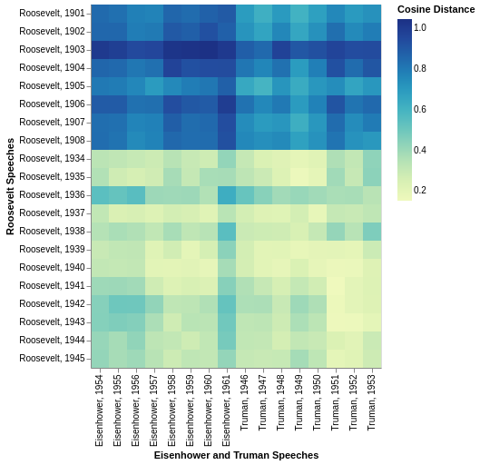

# Text Data

*A tool for exploring and analyzing text data*

`text_data` is a lightweight, performant, and framework-independent tool for analyzing text data in Python. Requiring only `numpy` and
`IPython`, it offers a suite of features that make it easy to
search through documents, compute statistics on those documents,
and visualize your findings.

Its key features are:

- An [inverted positional index](https://nlp.stanford.edu/IR-book/html/htmledition/positional-indexes-1.html) allowing you to efficiently conduct boolean searches across a set of documents, including for arbitrarily long phrases.
- A set of statistical calculations for analyzing text data, most of which work either as single point estimates or as vectorized calculations across an entire corpus.
- A flexible design that makes it easy to split up your corpus so you can explore and try to find out what makes different portions of a corpus distinct.
- An optional dependency that allows you to display data visualizations of your findings.

The visualizations and analyses you can conduct can run from the simple to the complex. At a simple level, you can compute the counts of individual words, mocking the behavior of `collections.Counter`. But you can also find the TF-IDF scores of every word-document pair in the corpus or manipulate `numpy` arrays to your heart's desire. On a visual front, you can do anything from building simple bar charts of word counts to building heatmaps showing the outputs of a machine learning model. This, for instance, shows the cosine distances between the `doc2vec` vectors in different State of the Union Addresses, using [the Kaggle State of the Union Corpus](https://www.kaggle.com/rtatman/state-of-the-union-corpus-1989-2017):



## Table of Contents

- [Getting Started](#getting-started)
- [A More Complete Pitch](#a-more-complete-pitch)
- [Anti-Pitch](#anti-pitch)
- [Future Roadmap](#future-roadmap)
- [Contributing](#contributing)
- [Credits](#credits)

## Getting Started

There are two ways to install `text_data`. The minimal version of the tool can be installed with a simple `pip install`:

```bash
pip install text_data
```

If you want to install features for visualizing your findings, you
can optionally install those using:

```bash
pip install text_data[display]
```

or

```bash
poetry add text_data -E display
```

## A More Complete Pitch

My idea for this library stemmed from a story I wrote [on the way that politicians message themselves in different platforms](https://coloradosun.com/2020/09/04/cory-gardner-john-hickenlooper-campaign-messaging/).

While I was working on that story, I noticed that I was writing a few functions that I felt could be generalized for other text-based analyses. Specifically, I spent a lot of my time writing code to display documents that matched certain phrases and and compute statistics comparing one set of documents to another. In addition, the code that I was writing was painfully inefficient.

This library aims to address all of these problems. Searching is as easy as collecting a list of raw text and a tokenizer, and creating a corpus. Using parallelized Rust code and an efficient indexing structure, the search results and vectorized statistical calculations return rapidly.

In addition, the code only relies on `numpy` and `IPython`, and its design is aimed to make it simple to use regardless of what other frameworks or libraries your analysis is using.

## Anti-Pitch

The biggest drawback of this library is that it is not cache-efficient. All of the matrix calculations currently return `numpy` arrays, which are very sparse and thus pose more of a memory burden than they need to. In addition, the library does not have any support for storing data in SQL. As a result, it's not well suited for tasks in which you have large quantities of text data. (Eventually, [I hope to change that](#future-roadmap).)

In addition, there are some frameworks whose authors have thought long and hard about how to help people explore text. (I've only used it a couple of times in a very exploratory manner, but [`fastai`](https://github.com/fastai/fastai) comes to mind.) If you're using one of those libraries already, you might be best off sticking with what you have.

## Future Roadmap

There are a number of goals I have with `text_data`. First of all, I would love to see its set of supported statistical computations continually expand. If you have an idea of something that should be supported, please file an issue or fork the library and file a pull request.

More concretely, I want to add the following functionality:

- Sparse matrix support in `scipy`. This will help address some of the current problems the library has with memory efficiency.
- Support for SQL.
- Support for word co-occurrence matrix calculations and support for boolean `WITHIN` searches.

And I'm very open to other ideas.

## Contributing

There are two related code bases for this project. The first is the Python code base, while the second is the Rust code base. Assuming you have Python 3.7+ and `poetry` installed, you should be able to install the Python dependencies with

```bash
poetry install
```

In order to compile the Rust code, you will need to have Rust and
Cargo installed. Installation instructions are available on [Rust's website](https://www.rust-lang.org/tools/install). Testing also relies on [`clippy`](https://github.com/rust-lang/rust-clippy), [`rustfmt`](https://github.com/rust-lang/rustfmt), and [`cargo tarpaulin`](https://github.com/xd009642/tarpaulin).

If you only want to mess around with the Python code and do not want to touch the Rust code, you can run

```bash
poetry run make lint-py
poetry run pytest
```
to lint and test the Python code. Running

```bash
poetry run make lint
poetry run make test
```
will run the full test suite.

Once you've changed the code, written tests, and added documentation to this project, file a pull request. That will trigger a GitHub action. If the tests and linting passes, I will review the code and decide whether to incorporate the code into the project.

## Credits

- This package was created with [Cookiecutter](https://github.com/audreyr/cookiecutter) and the 
[audreyr/cookiecutter-pypackage](https://github.com/audreyr/cookiecutter-pypackage) project template.

- The structure of the Rust code is heavily modified from, but inspired by, this [inverted index crate in Rust](https://github.com/tikue/inverted_index).

- Some of the statistical functions and indexing functions from this crate were inspired by `scikit`, `pandas`, or `nltk` (in particular, the design of the TF-IDF matrix function, which is modeled after `scikit`'s `TfidfTransformer`.)

- The visualization functions were modified from examples on [`altair`'s website](https://altair-viz.github.io/).

- I relied on the design of the positional index from [*Introduction to Information Retrieval*](https://nlp.stanford.edu/IR-book/) by Manning, Raghavan and Schütze.

- ["Fightin' Words: Lexical Feature Selection and Evaluation for Identifying the Content of Political Conflict"](http://languagelog.ldc.upenn.edu/myl/Monroe.pdf) by Monroe, Colaresi, and Quinn formed the inspiration of some of the statistical computations and of the word frequency graphic.

