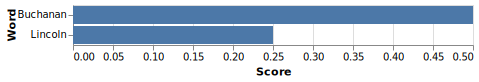

.. _exploration:

Exploring Text Data
===================

Searching Through Documents
---------------------------

While looking at numbers can be interesting, it's also important
to make sure that you look at the underlying text when you conduct your
analysis. For instance, while you could show how often Buchanan and Lincoln
talked about slavery in their State of the Union addresses, the numbers alone
don't tell much of the story.

As your analysis could show, Buchanan actually mentioned slavery in a larger
percentage of his speeches than Lincoln did:

.. code-block::

    slavery_document = text_data.display.render_bar_chart(
        np.array(["Lincoln", "Buchanan"]),
        np.array([lincoln_corpus.document_frequency("slavery"), buchanan_corpus.document_frequency("slavery")])
    )

        State of the Union speeches than Lincoln.

But a quick glance at the raw text will show how different the language
Buchanan used was from the language Lincoln used. :code:`text_data` makes it
easy to make those glances:

.. code-block::

    lincoln_corpus.display_search_results("slavery", window_size=400)

.. raw:: html 

    
<b>Showing Result 0 (Document ID 0)</b>

<b>&hellip;</b>tates\nadopting abolishment of <b>slavery</b>, but in such way that no slave shall be\ntwice accounted for.\n\nART.--Congress may appropriate money and otherwise provide for\ncolonizing free colored persons with their own consent at any place or\nplaces without the United States. I beg indulgence to discuss these\nproposed articles at some length. Without <b>slavery</b> the rebellion could\nnever have existed; without <b>slavery</b> it could not continue.\n\nAmong the friends of the Union there is great diversity of sentiment\nand of policy in regard to <b>slavery</b> and the African race amongst us.\nSome would perpetuate <b>slavery</b>; some would abolish it suddenly and\nwithout compensation; some would abolish it gradually and with\ncompensation: some would remove the freed people from us, and some\nwould retain them with us; and there are y<b>&hellip;</b>

.. code-block::

    buchanan_corpus.display_search_results("slavery", window_size=400)

.. raw:: html

    
<b>Showing Result 0 (Document ID 0)</b>

<b>&hellip;</b> of events the inhabitants of any Territory shall have\nreached the number required to form a State, they will then proceed in a\nregular manner and in the exercise of the rights of popular sovereignty to\nform a constitution preparatory to admission into the Union. After this has\nbeen done, to employ the language of the Kansas and Nebraska act, they\n&quot;shall be received into the Union with or without <b>slavery</b>, as their\nconstitution may prescribe at the time of their admission.&quot; This sound\nprinciple has happily been recognized in some form or other by an almost\nunanimous vote of both Houses of the last Congress.\n\nAll lawful means at my command have been employed, and shall continue to be\nemployed, to execute the laws against the African slave trade. After a most\ncareful and rigorous examination of our <b>&hellip;</b>

<b>Showing Result 1 (Document ID 3)</b>

<b>&hellip;</b>een subverted. A provisional government having been instituted\nunder circumstances which promise durability, it has been formally\nrecognized.\n\nI have been reluctantly obliged to ask explanation and satisfaction for\nnational injuries committed by the President of Hayti. The political\nand social condition of the Republics of Hayti and St. Domingo is very\nunsatisfactory and painful. The abolition of <b>slavery</b>, which has been\ncarried into effect throughout the island of St. Domingo and the entire\nWest Indies, except the Spanish islands of Cuba and Porto Rico, has\nbeen followed by a profound popular conviction of the rightfulness of\nrepublican institutions and an intense desire to secure them. The\nattempt, however, to establish republics there encounters many\nobstacles, most of which may be supposed to <b>&hellip;</b>

Conducting an analysis on :code:`n=3` is, of course, never a good idea, regardless of the context.
But :code:`text_data` makes searching through your documents easy so you can spot holes in your
analyses or better understand the context for why you keep seeing a really weird word or phrase
in a document set.

More complicated searches are available, too. :code:`text_data` has support for
writing arbitrarily long phrase queries or for combining queries.

Conclusion
----------

This getting started guide hopefully gave you a brief foray into the things
:code:`text_data` does. The intention with this guide was to explain the goals
of the library and contextualize it in an example data analysis project and hopefully
give you some ideas about how you might incorporate the tool into a project.

The API for the library is next. That has more detailed usage guides in it.