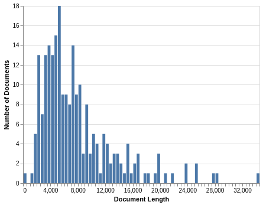

.. _getting_started:

Getting Started
================

Getting Started
---------------

To get started, I'm going to assume you followed the
:ref:`installation` guide, both installing :code:`text_data`
and its optional dependencies and downloading the State of the Union
Corpus. I'm also going to assume you're using Jupyter or some other
interactive Python environment that lets you visually render the results of your code.
(Assuming you plan on following along.)

Setting up the Data
-------------------

Let's get started by loading the State of the Union data into
:code:`pandas`. This isn't strictly necessary for :code:`text_data`,
but it will make our lives a little bit easier.

The State of the Union speeches are each held in separate files
within the directory, each in the format :code:`"name_year.text"`. So here's what
the code loading the files in looks like:

.. code-block:: python

    import glob
    import re

    import pandas as pd

    def load_data():
        files = glob.glob("sotu-data/*.txt")
        path_desc = re.compile(r"sotu-data/([A-Za-z]+)_([0-9]{4})\.txt")
        for filepath in files:
            with open(filepath, "r") as f:
                raw_text = f.read()
            president, year = path_desc.search(filepath).groups()
            yield {"president": president, "year": year, "speech": raw_text}

    sotu_data = pd.DataFrame(load_data())

From here, we can get started using :code:`text_data`.

Creating a :class:`~text_data.index.Corpus`
--------------------------------------------

Over the rest of this tutorial, I'll be going over what
a :class:`~text_data.index.Corpus` is in more detail. But essentially,
it operates as an index that stores our text data in a way that makes it easy
to quickly compute statistics about the how language is used
in a set of documents and search through the documents
themselves to hopefully find interesting patterns.

The only requirement to instantiate it is a list of documents. Now that you have
a set of documents, you can form a :code:`Corpus`.

.. code-block::

    import text_data

    sotu_corpus = text_data.Corpus(list(sotu_data))

This indexed the State of the Union speeches. From here, you can conduct some introductory
exploratory analysis.

To start off, let's just compute a couple of simple statistics to learn more about
our data. It will be helpful, for instance, if we know how many words our corpus has:

.. code-block::

    >>> sotu_corpus.num_words
    1786621

Similarly, here's how many unique words there are:

.. code-block::

    >>> sotu_corpus.vocab_size
    24927

And here are the five most common words:

.. code-block::

    >>> sotu_corpus.most_common(5)
    [('the', 149615), ('of', 96394), ('and', 60703), ('to', 60642), ('in', 38521)]

All of this stuff pans out; our most common words are, in fact, common and
there are far more words in our corpus than there are unique words.

But the core of this library, and the core of text analysis, lies in analyzing
more than a couple of words.

:code:`text_data` offers a number of ways to analyze a million words of text,
but I'll start with one of
its graphical tools. If you have the optional dependencies installed, you
can create a histogram. This code will build a histogram showing
the number of words in all of the documents.

.. code-block::

    >>> text_data.display.histogram(
            list(sotu_corpus.doc_lengths.values()),
            x_label="Document Length"
        )

There's a lot to go over in this graphic, but something that should stick out eventually
is that one of the values appears to be 0, meaning there are no words in the entire document.

You can further validate this and pin down the document causing the problem:

.. code-block::

    >>> sorted(sotu_corpus.doc_lengths.items(), key=lambda x: x[1])[:3]
    [(80, 0), (214, 1374), (62, 1505)]

There's a document with the index of 80 that has 0
words in it. If you go to the original data on Kaggle, you can see
that the data is blank there.

Since there's nothing we can do to fix this issue, let's just delete
this record. We should also delete the record from :code:`pandas`:

.. code-block::

    >>> sotu_corpus.split_off({80})
    >>> sotu_data = sotu_data[~sotu_data.index.isin({80})]

But as we'll soon see, there are problems on our end, as well.
In order to illustrate those, I'm going to compute something called
a term-document matrix of TF-IDF scores across the corpus. Roughly
speaking, this finds how frequently words occur in each of the documents
in our corpus and normalizes those frequencies based on how often
the words appear in other documents. By doing this, we can generally
gauge what makes each document distinct from the rest of the documents
in the corpus.

.. code-block::

    >>> import numpy as np
    >>> tfidf = sotu_corpus.tfidf_matrix()
    >>> top_words, _top_scores = sotu_corpus.get_top_words(tfidf, top_n=5)
    >>> list(np.unique(top_words.flatten()))

I'm not going to show the entire list, because it's very long. But suffice to
say there are a lot of words that look like this:

- 1924
- 1958
- 2005

In other words, the thing we're using to split up words is holding onto way
too many years. If we're trying to figure out what makes one president's
speeches different from another's, what distinguishes one speech from another,
or even what makes two documents similar, words like this risk getting in our
way.

Conclusion
----------

This kind of exploratory analysis — running quick spot checks to identify
problem spots in how you've tokenized text and to identify places where, say,
a document just appears blank for some reason — is an important step in analyzing
text data. :code:`text_data` tries to make this process as easy as possible, by
providing graphical tools to allow you to visualize you findings, statistical calculations
to help you conduct your analysis, and search tools to help you make sense of the text
you're reading.

In the next part, I'll go over how you can write tokenizers to better
handle your text data and how you can split up your corpus
so you can analyze parts of it separately.